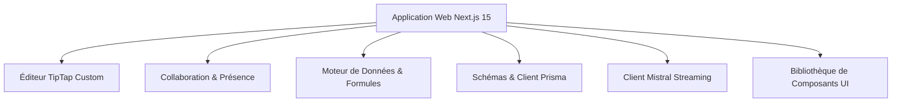

# NotoFlow — Clone Notion Premium (Production-Ready)

NotoFlow est un clone moderne, premium et hautement interactif de Notion. Conçu comme une application SaaS complète, il s'appuie sur un monorepo géré avec **pnpm** et **Turborepo** pour offrir un éditeur de texte collaboratif en temps réel, un moteur de bases de données multi-vues interactives, une recherche instantanée globale, un assistant de rédaction IA en streaming, ainsi qu'une gestion complète des abonnements.

---

## 🛠️ Architecture du Monorepo

Le projet est structuré en plusieurs packages réutilisables et applications sous l'arborescence suivante :



### 📦 Description des Packages
* **`apps/web`** : Application web principale Next.js 15 (App Router) utilisant Tailwind CSS pour le style et les Server Actions pour les interactions sécurisées avec la base de données.
* **`packages/editor`** : Wrapper d'éditeur WYSIWYG basé sur **TipTap** enrichi d'un menu intelligent (Slash `/`), du support des touches directionnelles, et de blocs personnalisés interactifs (e.g. rendu de bases de données imbriquées, blocs d'assistant IA).
* **`packages/realtime`** : Hook réactif exploitant **Supabase Realtime** pour le suivi des curseurs collaboratifs et la présence des utilisateurs (gestion d'avatars de couleur).
* **`packages/database-engine`** : Noyau fonctionnel qui filtre, trie, groupe et calcule les formules (champs calculés personnalisés) pour les bases de données NotoFlow.
* **`packages/database`** : Modèles de données **Prisma** avec client pré-généré et scripts d'initialisation (seeds) pour Postgres.
* **`packages/ai`** : Module client Mistral configuré pour générer du texte en continu (streaming) avec gestion de prompts prédéfinis.
* **`packages/ui`** : Composants graphiques fondamentaux (dialogues, boutons, menus) basés sur Radix UI.

---

## ✨ Fonctionnalités Clés

### 📝 Éditeur Notion Interactif
* Menu contextuel intelligent s'activant avec le caractère `/` (Slash Commands).
* Rendu dynamique et inline des bases de données au sein du contenu textuel.
* Système d'invites de commandes IA intégrées directement dans le flux d'écriture.

### 👥 Collaboration Temps Réel
* Suivi dynamique des positions des curseurs de saisie de chaque collaborateur.
* Affichage d'avatars colorés représentant la présence en temps réel des utilisateurs.
* Synchronisation instantanée des documents à chaque mise à jour.

### 📊 Moteur de Bases de Données (Views)
* Rendu polyvalent sous forme de **Table**, **Kanban (Status)** et **Calendrier (Dates)**.
* Tri sur plusieurs attributs, filtres avancés et champs calculés automatiques.
* Édition en ligne (inline editing) des cellules (textes, statuts, dates, cases à cocher).

### 📁 Système de Documents
* **Upload drag & drop** de fichiers (PDF, Word, Excel, PowerPoint, images, texte).
* **Visualisation inline** : PDF natif, Word/Excel/PowerPoint via Google Docs Viewer, images natives.
* **Tagging avancé** : organisation par tags multiples, filtres dynamiques, suggestions intelligentes.
* **Stockage Supabase** : fichiers hébergés dans un bucket public avec politiques RLS sécurisées.
* **Permissions granulaires** : upload (EDITOR+), suppression (OWNER/ADMIN + propriétaire).

### 🤖 Assistant IA Rédacteur (Streaming)
* Génération de texte en continu (Server-Sent Events) via Mistral (mistral-large).
* Actions rapides prédéfinies :
  - **Améliorer le style** : Reformulation fluide et ton professionnel.
  - **Résumer** : Extraction synthétique sous forme de liste à puces.
  - **Développer** : Enrichissement automatique du texte fourni.
  - **Traduire** : Traduction multi-langues instantanée.

### 🔍 Recherche Globale (CMD+K)
* Palette de recherche globale accessible via le raccourci `Cmd+K` (ou `Ctrl+K`).
* Recherche full-text indexée en base de données PostgreSQL avec debounce automatique de 250ms.
* Interface premium dotée d'animations fluides avec Framer Motion.

### 💳 Facturation SaaS & Abonnements
* Gestion des plans de souscription : **Free**, **Pro** (8€/mois) et **Team** (15€/membre/mois).
* Simulation sécurisée de passerelle de paiement (Stripe Checkout-ready) avec changement de plan dynamique des espaces de travail.

---

## 💾 Schéma de Base de Données (Prisma)

Voici les principaux modèles définis dans le schéma PostgreSQL (`packages/database/prisma/schema.prisma`) :

* **`User`** : Profil utilisateur synchronisé avec les sessions d'authentification Supabase.
* **`Workspace`** : Conteneur des pages et bases de données. Porte les informations d'abonnement (`plan`, `billingCustomer`, `billingSub`).
* **`WorkspaceMember`** : Table de liaison associant les utilisateurs aux espaces avec des rôles distincts (`OWNER`, `ADMIN`, `EDITOR`, `VIEWER`, `GUEST`).
* **`Page`** : Document principal de l'éditeur. Peut être imbriqué (`parentId`) et partagé publiquement (`isPublic`).
* **`Database`** : Conteneur de métadonnées de schémas (colonnes définies au format JSON) et de configurations de vues.
* **`DatabaseRow`** : Contient les valeurs concrètes de chaque ligne au format JSON (`values`).
* **`Document`** : Métadonnées des fichiers uploadés (nom, type, taille, URL Supabase Storage, tags).
* **`Favorite`** : Permet aux utilisateurs d'épingler leurs documents préférés.

---

## 🚀 Démarrage Rapide

### Prérequis
* **Node.js** version 20 ou supérieure.
* **pnpm** version 9 ou supérieure.

### Installation
1. Clonez le dépôt et installez les dépendances :
   ```bash
   pnpm install
   ```
2. Créez votre fichier de configuration local :
   ```bash
   cp .env.example .env.local
   ```
3. Renseignez les variables d'environnement requises dans `.env.local` :
   * `DATABASE_URL` (Base PostgreSQL)
   * `NEXT_PUBLIC_SUPABASE_URL` (Supabase API)
   * `NEXT_PUBLIC_SUPABASE_ANON_KEY` (Supabase Clé publique)
   * `MISTRAL_API_KEY` (Clé API Mistral pour l'assistant IA)

### Préparation de la Base de Données
Initialisez le schéma Prisma et chargez les données de test :
```bash
pnpm db:generate
pnpm db:push
pnpm db:seed
```

### Lancement du Serveur de Développement
Démarrez l'application web Next.js en mode développement :
```bash
pnpm dev
```
L'application est disponible à l'adresse : [http://localhost:3000](http://localhost:3000).

---

## 🛠️ Commandes Utiles

| Commande | Description |
| :--- | :--- |
| `pnpm dev` | Lance l'application avec compilation rapide Turbopack. |
| `pnpm build` | Compile l'ensemble des modules du monorepo en bundle de production. |
| `pnpm lint` | Valide les standards de code et de style via ESLint. |
| `pnpm typecheck` | Vérifie la cohérence des types TypeScript. |
| `pnpm format` | Formate les fichiers sources à l'aide de Prettier. |

---

## 🔍 Résolution des Problèmes Courants (Troubleshooting)

### ⚠️ Erreur `EPERM: operation not permitted` sur Windows (Prisma)
Lors de l'exécution de `pnpm build` ou `prisma generate`, Windows peut verrouiller le fichier binaire de l'engine Prisma (`query_engine-windows.dll.node`) s'il est utilisé par un processus en arrière-plan.
* **Solution** : Arrêtez tous les serveurs de développement en cours, fermez les terminaux actifs, puis relancez la commande.

### ⚠️ Erreur `SyntaxError: Unexpected end of JSON input` au Build
Si un build précédent a été interrompu brusquement, le cache de build de Next.js peut être corrompu.
* **Solution** : Nettoyez les dossiers de cache générés en exécutant la commande suivante dans votre terminal :
  ```powershell
  Remove-Item -Path apps/web/.next -Recurse -Force -ErrorAction SilentlyContinue
  pnpm --filter @notoflow/web build
  ```
